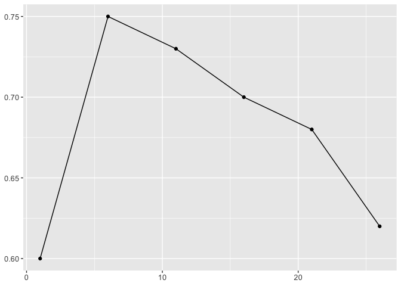

<!-- README.md is generated from README.Rmd. Please edit that file -->

# rWinePredictor

<!-- badges: start -->
<!-- badges: end -->

The goal of rWinePredictor is to provide functions that may be useful
when building classifiers. This package was originally inteded for a
wine quality classifier based on physical and chemical properties of the
wine but functions in this package can be used in other models.

## Installation

You can install the development version of rWinePredictor from
[GitHub](https://github.com/) with:

``` r
# install.packages("devtools")
devtools::install_github("DSCI-310-2024/rWinePredictor")
```

## Example

A dataset may look like this:

``` r
df <- data.frame(
  quality = c('good', 'bad', 'good'),
  alcohol = c(10, 12, 14),
  sugars = c(1.5, 20, 7.7),
  pH = c(3.3, 4, 2.9),
  stringsAsFactors = TRUE
)
```

We can import this package and begin with some EDA by generating summary
data grouped by the classes of the target variable in our dataset using
`rWinePredictor::generate_summary_stats()`

``` r
library(rWinePredictor)

generate_summary_stats(df, quality)
#> # A tibble: 2 × 6
#>   quality count percentage alcohol_avg sugars_avg pH_avg
#>   <fct>   <int>      <dbl>       <dbl>      <dbl>  <dbl>
#> 1 bad         1       33.3          12       20      4  
#> 2 good        2       66.7          12        4.6    3.1
```

When building the model, you will likely tune the hyperparamters. This
package has a function for generating scatter plots with connecting
lines to find the ideal hyperparamter value. For example you might have
a set of accuracies for given k values in a K-NN model. Using
`rWinePredictor::create_lineplot()`, you can plot these values.

``` r
acc_k <- data.frame(
  acc = c(0.6, 0.75, 0.73, 0.7, 0.68, 0.62),
  k_val = c(1, 6, 11, 16, 21, 26))

plt <- create_lineplot(acc_k, k_val, acc)

plot(plt)
```



Lastly, different model metrics can easily be calculated using
`rWinePredictor::calculate_model_metric()`.

``` r
library(yardstick)

model_df = yardstick::two_class_example

accuracy <- calculate_model_metric(model_df, truth_col='truth', predictions_col='predicted', metric="accuracy")
```
